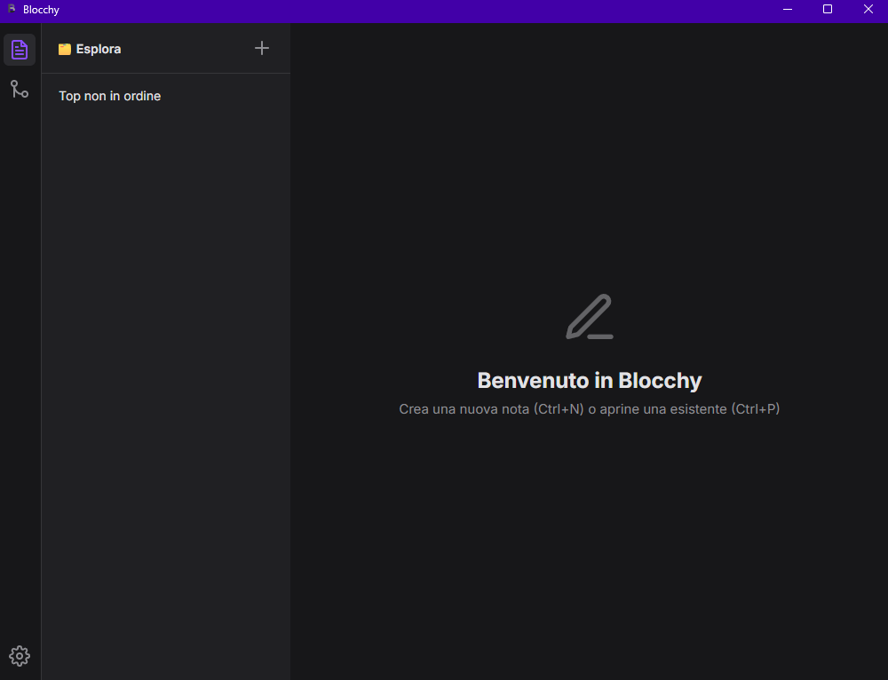

 > A beautifully simple and elegant notepad for those who love minimalism and style.

[](https://github.com/skirdrag/Blocchy/releases/latest)
[](LICENSE)
[](https://github.com/skirdrag/Blocchy/issues)

Blocchy is a distraction-free, gorgeous dark-themed notepad that provides the perfect canvas for your thoughts, ideas, and lists. As a transparent, open-source project, Blocchy is crafted with care and is forever free for everyone.

## ✨ Features

* **Minimalist Interface:** A clean and elegant user interface that stays out of your way.
* **Dark Theme:** A beautiful dark mode to reduce eye strain and enhance focus.
* **Simple & Fast:** Designed to be lightweight and responsive.
* **Open Source:** Free to use, modify, and distribute.

## 📸 Screenshots

*A screenshot of the main interface of Blocchy.*


## 🚀 Getting Started

If you are busy you can download the simple setup in the release page.

Or you can do this:↙
### Prerequisites

This project is built with Python and Flask. You will need to have Python installed on your system.

### Installation

1.  Clone the repository:
    ```sh
    git clone [https://github.com/skirdrag/Blocchy.git](https://github.com/skirdrag/Blocchy.git)
    ```
2.  Navigate into the project directory:
    ```sh
    cd Blocchy
    ```
3.  (Optional but recommended) Create a virtual environment:
    ```sh
    python -m venv venv
    source venv/bin/activate  # On Windows use `venv\Scripts\activate`
    ```
4.  Install the required dependencies:
    ```sh
    pip install -r requirements.txt
    ```
    *(Note: You need to create a `requirements.txt` file by running `pip freeze > requirements.txt` in your terminal)*

### Usage

Run the following command to start the Flask application:
```sh
flask run
```
